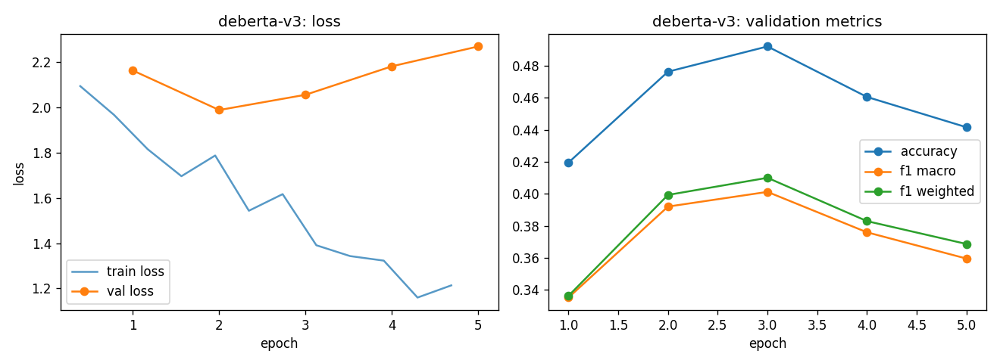

# deberta-v3 - fine-tuning report (lr-sweep-01)

- base checkpoint: `microsoft/deberta-v3-base`
- model weights: https://huggingface.co/LorenzoAleCon29/deberta-v3-ecb-hawkish-dovish
- epochs run: 5.0  |  lr: 5e-05  |  train batch size: 32

## Validation (per epoch)

| epoch | train loss | val loss | accuracy | f1 macro | f1 weighted |
|---|---|---|---|---|---|
| 1 | 2.0313 | 2.1639 | 0.4196 | 0.3352 | 0.3363 |
| 2 | 1.7669 | 1.9892 | 0.4763 | 0.3921 | 0.3994 |
| 3 | 1.5806 | 2.0567 | 0.4921 | 0.4013 | 0.4101 |
| 4 | 1.3526 | 2.1826 | 0.4606 | 0.3760 | 0.3830 |
| 5 | 1.1869 | 2.2704 | 0.4416 | 0.3596 | 0.3687 |

Best epoch by f1_macro: **3** (0.4013)

## Test set

| loss | accuracy | f1 macro | f1 weighted |
|---|---|---|---|
| 2.1243 | 0.4868 | 0.3933 | 0.3991 |

