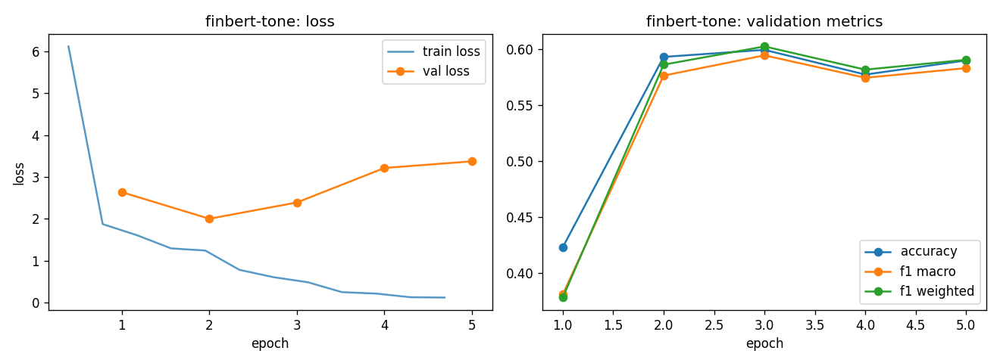

# finbert-tone - fine-tuning report (lr-sweep-01)

- base checkpoint: `yiyanghkust/finbert-tone`
- model weights: https://huggingface.co/LorenzoAleCon29/finbert-tone-ecb-hawkish-dovish
- epochs run: 5.0  |  lr: 5e-05  |  train batch size: 32

## Validation (per epoch)

| epoch | train loss | val loss | accuracy | f1 macro | f1 weighted |
|---|---|---|---|---|---|
| 1 | 3.9978 | 2.6373 | 0.4227 | 0.3806 | 0.3778 |
| 2 | 1.3822 | 2.0026 | 0.5931 | 0.5763 | 0.5861 |
| 3 | 0.6932 | 2.3913 | 0.5994 | 0.5945 | 0.6024 |
| 4 | 0.3156 | 3.2160 | 0.5773 | 0.5744 | 0.5817 |
| 5 | 0.1229 | 3.3749 | 0.5899 | 0.5831 | 0.5905 |

Best epoch by f1_macro: **3** (0.5945)

## Test set

| loss | accuracy | f1 macro | f1 weighted |
|---|---|---|---|
| 2.6203 | 0.5845 | 0.5771 | 0.5838 |

