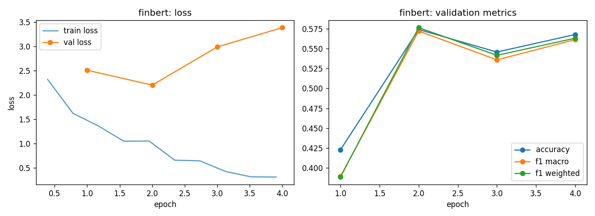

# finbert - fine-tuning report (lr-sweep-01)

- base checkpoint: `ProsusAI/finbert`
- model weights: https://huggingface.co/LorenzoAleCon29/finbert-ecb-hawkish-dovish
- epochs run: 4.0  |  lr: 5e-05  |  train batch size: 32

## Validation (per epoch)

| epoch | train loss | val loss | accuracy | f1 macro | f1 weighted |
|---|---|---|---|---|---|
| 1 | 1.9730 | 2.5095 | 0.4227 | 0.3891 | 0.3884 |
| 2 | 1.1567 | 2.2048 | 0.5741 | 0.5722 | 0.5765 |
| 3 | 0.6542 | 2.9889 | 0.5457 | 0.5359 | 0.5416 |
| 4 | 0.3545 | 3.3860 | 0.5678 | 0.5613 | 0.5632 |

Best epoch by f1_macro: **2** (0.5722)

## Test set

| loss | accuracy | f1 macro | f1 weighted |
|---|---|---|---|
| 1.9325 | 0.6078 | 0.6054 | 0.6115 |

