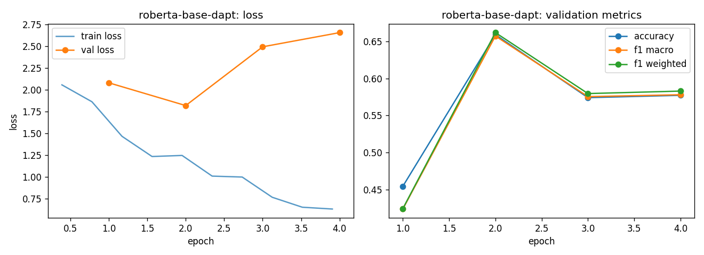

# roberta-base-dapt - fine-tuning report (lr-sweep-01)

- base checkpoint: `LorenzoAleCon29/roberta-base-ECB-dapt`
- model weights: https://huggingface.co/LorenzoAleCon29/roberta-base-dapt-ecb-hawkish-dovish
- epochs run: 4.0  |  lr: 5e-05  |  train batch size: 32

## Validation (per epoch)

| epoch | train loss | val loss | accuracy | f1 macro | f1 weighted |
|---|---|---|---|---|---|
| 1 | 1.9600 | 2.0809 | 0.4543 | 0.4235 | 0.4240 |
| 2 | 1.3149 | 1.8191 | 0.6593 | 0.6575 | 0.6621 |
| 3 | 1.0026 | 2.4947 | 0.5741 | 0.5755 | 0.5796 |
| 4 | 0.6815 | 2.6577 | 0.5773 | 0.5781 | 0.5830 |

Best epoch by f1_macro: **2** (0.6575)

## Test set

| loss | accuracy | f1 macro | f1 weighted |
|---|---|---|---|
| 1.9001 | 0.6496 | 0.6504 | 0.6545 |

