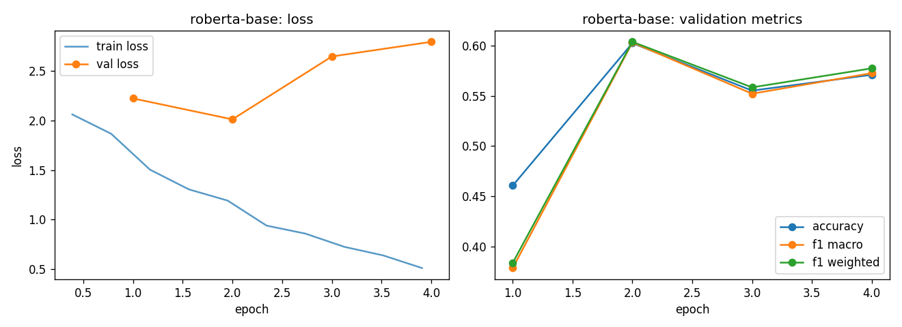

# roberta-base - fine-tuning report (lr-sweep-01)

- base checkpoint: `roberta-base`
- model weights: https://huggingface.co/LorenzoAleCon29/roberta-base-ecb-hawkish-dovish
- epochs run: 4.0  |  lr: 5e-05  |  train batch size: 32

## Validation (per epoch)

| epoch | train loss | val loss | accuracy | f1 macro | f1 weighted |
|---|---|---|---|---|---|
| 1 | 1.9632 | 2.2227 | 0.4606 | 0.3784 | 0.3836 |
| 2 | 1.3334 | 2.0110 | 0.6025 | 0.6032 | 0.6038 |
| 3 | 0.8991 | 2.6453 | 0.5552 | 0.5521 | 0.5584 |
| 4 | 0.6255 | 2.7930 | 0.5710 | 0.5726 | 0.5774 |

Best epoch by f1_macro: **2** (0.6032)

## Test set

| loss | accuracy | f1 macro | f1 weighted |
|---|---|---|---|
| 2.0651 | 0.5984 | 0.5983 | 0.5981 |

