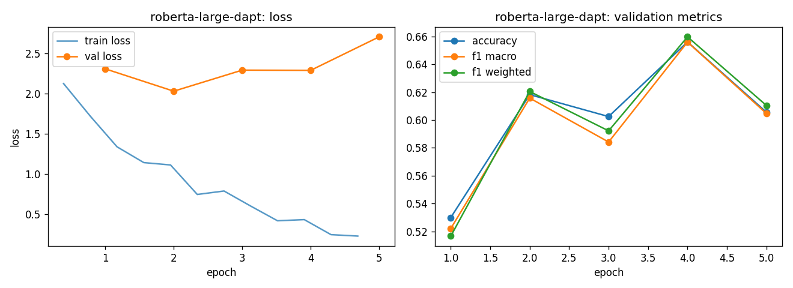

# roberta-large-dapt - fine-tuning report (lr-sweep-01)

- base checkpoint: `LorenzoAleCon29/roberta-large-ECB-dapt`
- model weights: https://huggingface.co/LorenzoAleCon29/roberta-large-dapt-ecb-hawkish-dovish
- epochs run: 5.0  |  lr: 3e-05  |  train batch size: 32

## Validation (per epoch)

| epoch | train loss | val loss | accuracy | f1 macro | f1 weighted |
|---|---|---|---|---|---|
| 1 | 1.9211 | 2.3062 | 0.5300 | 0.5221 | 0.5166 |
| 2 | 1.1978 | 2.0290 | 0.6183 | 0.6158 | 0.6205 |
| 3 | 0.7680 | 2.2904 | 0.6025 | 0.5842 | 0.5923 |
| 4 | 0.4854 | 2.2879 | 0.6562 | 0.6561 | 0.6598 |
| 5 | 0.2388 | 2.7038 | 0.6057 | 0.6048 | 0.6105 |

Best epoch by f1_macro: **4** (0.6561)

## Test set

| loss | accuracy | f1 macro | f1 weighted |
|---|---|---|---|
| 2.2287 | 0.6744 | 0.6746 | 0.6777 |

