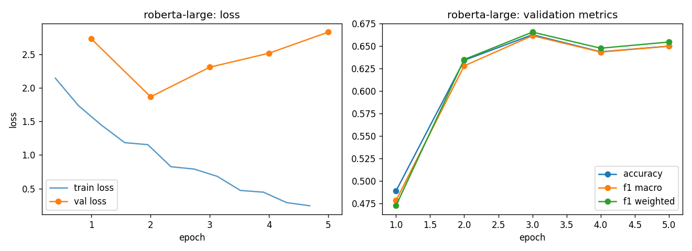

# roberta-large - fine-tuning report (lr-sweep-01)

- base checkpoint: `roberta-large`
- model weights: https://huggingface.co/LorenzoAleCon29/roberta-large-ecb-hawkish-dovish
- epochs run: 5.0  |  lr: 3e-05  |  train batch size: 32

## Validation (per epoch)

| epoch | train loss | val loss | accuracy | f1 macro | f1 weighted |
|---|---|---|---|---|---|
| 1 | 1.9385 | 2.7261 | 0.4890 | 0.4784 | 0.4726 |
| 2 | 1.2605 | 1.8659 | 0.6341 | 0.6279 | 0.6350 |
| 3 | 0.8090 | 2.3064 | 0.6625 | 0.6614 | 0.6654 |
| 4 | 0.5349 | 2.5142 | 0.6435 | 0.6432 | 0.6475 |
| 5 | 0.2693 | 2.8277 | 0.6498 | 0.6497 | 0.6544 |

Best epoch by f1_macro: **3** (0.6614)

## Test set

| loss | accuracy | f1 macro | f1 weighted |
|---|---|---|---|
| 2.2908 | 0.6527 | 0.6524 | 0.6558 |

