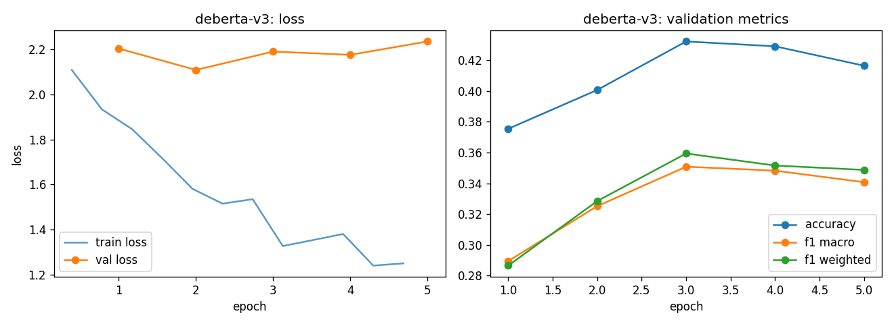

# deberta-v3 - fine-tuning report

- base checkpoint: `microsoft/deberta-v3-base`
- model weights: https://huggingface.co/LorenzoAleCon29/deberta-v3-fomc-hawkish-dovish
- epochs run: 5.0  |  lr: 3e-05  |  train batch size: 32

## Validation (per epoch)

| epoch | train loss | val loss | accuracy | f1 macro | f1 weighted |
|---|---|---|---|---|---|
| 1 | 2.0209 | 2.2031 | 0.3754 | 0.2894 | 0.2865 |
| 2 | 1.7144 | 2.1082 | 0.4006 | 0.3251 | 0.3284 |
| 3 | 1.5249 | 2.1896 | 0.4322 | 0.3508 | 0.3593 |
| 4 | 1.3537 | 2.1752 | 0.4290 | 0.3482 | 0.3515 |
| 5 | 1.2452 | 2.2346 | 0.4164 | 0.3407 | 0.3487 |

Best epoch by f1_macro: **3** (0.3508)

## Test set

| loss | accuracy | f1 macro | f1 weighted |
|---|---|---|---|
| 2.3435 | 0.4248 | 0.3437 | 0.3497 |

