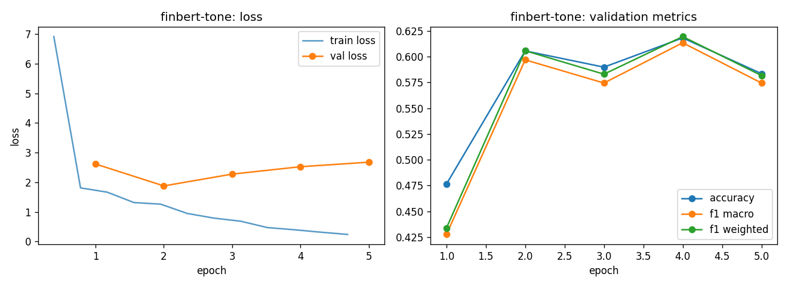

# finbert-tone - fine-tuning report

- base checkpoint: `yiyanghkust/finbert-tone`
- model weights: https://huggingface.co/LorenzoAleCon29/finbert-tone-fomc-hawkish-dovish
- epochs run: 5.0  |  lr: 3e-05  |  train batch size: 32

## Validation (per epoch)

| epoch | train loss | val loss | accuracy | f1 macro | f1 weighted |
|---|---|---|---|---|---|
| 1 | 4.3630 | 2.6162 | 0.4763 | 0.4275 | 0.4337 |
| 2 | 1.4134 | 1.8762 | 0.6057 | 0.5970 | 0.6058 |
| 3 | 0.8675 | 2.2747 | 0.5899 | 0.5745 | 0.5831 |
| 4 | 0.5168 | 2.5243 | 0.6183 | 0.6136 | 0.6196 |
| 5 | 0.2760 | 2.6772 | 0.5836 | 0.5745 | 0.5818 |

Best epoch by f1_macro: **4** (0.6136)

## Test set

| loss | accuracy | f1 macro | f1 weighted |
|---|---|---|---|
| 2.8046 | 0.5581 | 0.5560 | 0.5603 |

