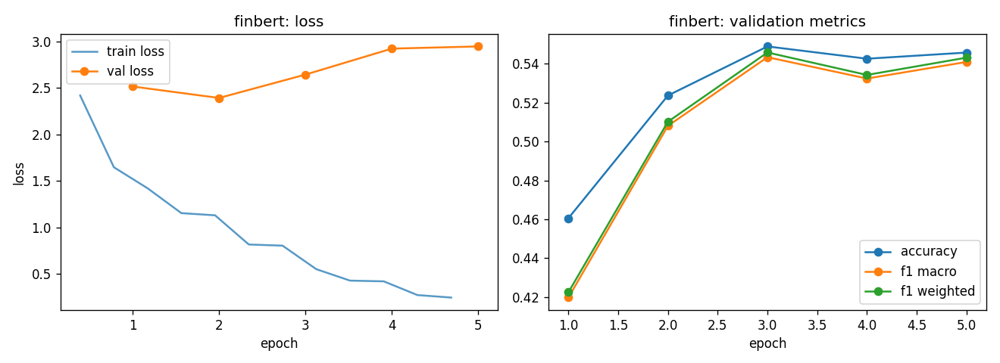

# finbert - fine-tuning report

- base checkpoint: `ProsusAI/finbert`
- model weights: https://huggingface.co/LorenzoAleCon29/finbert-fomc-hawkish-dovish
- epochs run: 5.0  |  lr: 3e-05  |  train batch size: 32

## Validation (per epoch)

| epoch | train loss | val loss | accuracy | f1 macro | f1 weighted |
|---|---|---|---|---|---|
| 1 | 2.0336 | 2.5160 | 0.4606 | 0.4198 | 0.4225 |
| 2 | 1.2357 | 2.3929 | 0.5237 | 0.5081 | 0.5102 |
| 3 | 0.8110 | 2.6442 | 0.5489 | 0.5434 | 0.5458 |
| 4 | 0.4672 | 2.9234 | 0.5426 | 0.5324 | 0.5342 |
| 5 | 0.2600 | 2.9469 | 0.5457 | 0.5409 | 0.5431 |

Best epoch by f1_macro: **3** (0.5434)

## Test set

| loss | accuracy | f1 macro | f1 weighted |
|---|---|---|---|
| 2.3797 | 0.5845 | 0.5777 | 0.5787 |

