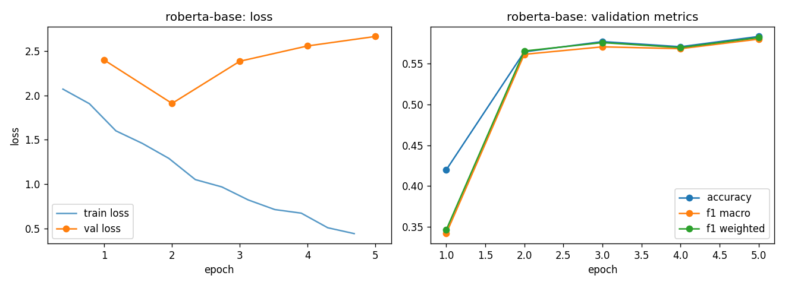

# roberta-base - fine-tuning report

- base checkpoint: `roberta-base`
- model weights: https://huggingface.co/LorenzoAleCon29/roberta-base-fomc-hawkish-dovish
- epochs run: 5.0  |  lr: 3e-05  |  train batch size: 32

## Validation (per epoch)

| epoch | train loss | val loss | accuracy | f1 macro | f1 weighted |
|---|---|---|---|---|---|
| 1 | 1.9898 | 2.4005 | 0.4196 | 0.3414 | 0.3458 |
| 2 | 1.4499 | 1.9108 | 0.5647 | 0.5616 | 0.5657 |
| 3 | 1.0089 | 2.3873 | 0.5773 | 0.5709 | 0.5760 |
| 4 | 0.7344 | 2.5602 | 0.5710 | 0.5686 | 0.5700 |
| 5 | 0.4731 | 2.6671 | 0.5836 | 0.5803 | 0.5822 |

Best epoch by f1_macro: **5** (0.5803)

## Test set

| loss | accuracy | f1 macro | f1 weighted |
|---|---|---|---|
| 2.5917 | 0.6031 | 0.6035 | 0.6062 |

