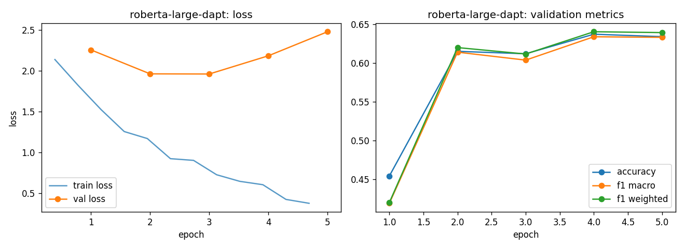

# roberta-large-dapt - fine-tuning report

- base checkpoint: `LorenzoAleCon29/roberta-large-ECB-dapt`
- model weights: https://huggingface.co/LorenzoAleCon29/roberta-large-dapt-fomc-hawkish-dovish
- epochs run: 5.0  |  lr: 2e-05  |  train batch size: 32

## Validation (per epoch)

| epoch | train loss | val loss | accuracy | f1 macro | f1 weighted |
|---|---|---|---|---|---|
| 1 | 1.9811 | 2.2571 | 0.4543 | 0.4190 | 0.4200 |
| 2 | 1.3168 | 1.9632 | 0.6151 | 0.6141 | 0.6200 |
| 3 | 0.9128 | 1.9614 | 0.6120 | 0.6038 | 0.6117 |
| 4 | 0.6584 | 2.1849 | 0.6372 | 0.6339 | 0.6404 |
| 5 | 0.3999 | 2.4799 | 0.6341 | 0.6332 | 0.6393 |

Best epoch by f1_macro: **4** (0.6339)

## Test set

| loss | accuracy | f1 macro | f1 weighted |
|---|---|---|---|
| 2.1546 | 0.6264 | 0.6274 | 0.6331 |

