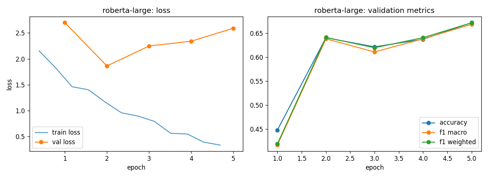

# roberta-large - fine-tuning report

- base checkpoint: `roberta-large`
- model weights: https://huggingface.co/LorenzoAleCon29/roberta-large-fomc-hawkish-dovish
- epochs run: 5.0  |  lr: 2e-05  |  train batch size: 32

## Validation (per epoch)

| epoch | train loss | val loss | accuracy | f1 macro | f1 weighted |
|---|---|---|---|---|---|
| 1 | 1.9921 | 2.7000 | 0.4479 | 0.4165 | 0.4189 |
| 2 | 1.3456 | 1.8638 | 0.6404 | 0.6381 | 0.6411 |
| 3 | 0.9286 | 2.2491 | 0.6215 | 0.6108 | 0.6195 |
| 4 | 0.6358 | 2.3416 | 0.6372 | 0.6382 | 0.6406 |
| 5 | 0.3646 | 2.5920 | 0.6719 | 0.6686 | 0.6717 |

Best epoch by f1_macro: **5** (0.6686)

## Test set

| loss | accuracy | f1 macro | f1 weighted |
|---|---|---|---|
| 2.6275 | 0.6667 | 0.6647 | 0.6684 |

